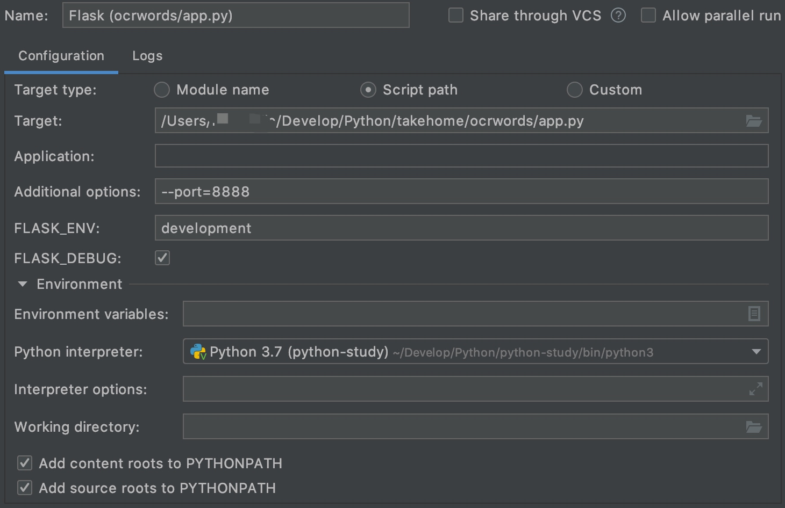
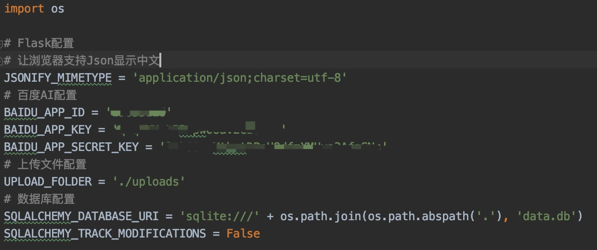
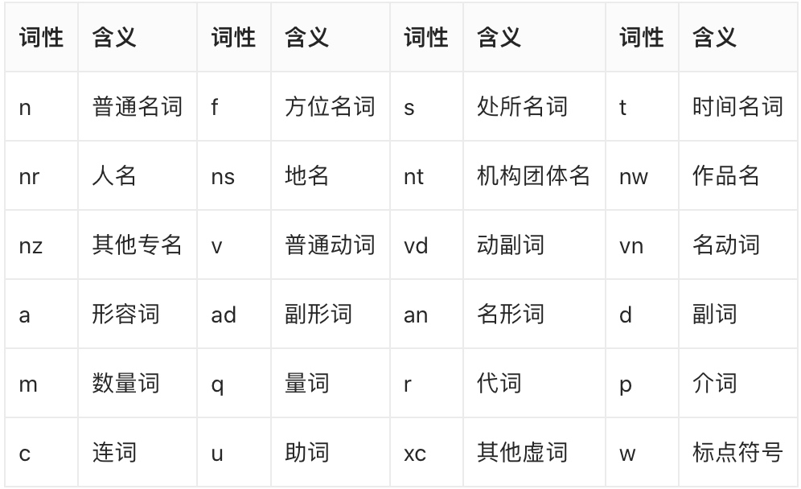

### 项目说明
项目使用 `Flask` 开发，数据库框架为 `SQLAlchemy`，**共用时 3 天**。

根据 `takehome/backend` 文档中的内容，我理解为：通过 OCR 识别图片中的文字，然后通过自然语言处理将文字归类并统计次数。

这里使用的是[百度AI 开放平台](https://ai.baidu.com)的接口。

考虑到 OCR 以及自然语言处理速度有点慢，故对在 `ocr` 和 `nlp` 表中增加了 `md5` 字段，用于标记对应的数据识别结果是否存在于数据库中，如果是，则直接从数据库中读取。

**补充**：测试部分没有完成，因为就两个接口，而且 OCR 识别跟自然语言处理的结果具有不确定性。

### 如何运行项目
项目代码在 `takehome/ocrwords` 目录下，使用 `PyCharm` 打开
1. 直接在项目目录下运行 `flask run` 命令，相关参数可以在命令行直接指定或者在 `.falskenv` 中配置
2. 配置 `Run/Debug Configurations`，具体如下图所示


在 `ocrwords` 目录下有 `config.py` 文件，用于配置一些参数，由于涉及到百度AI 的 KEY，所以没有上传，大致配置内容如下：



### 接口使用说明
接口说明：自然语言处理
接口地址：/ai/nlp
请求方式：POST | GET
请求参数：

| 名称 | 类型 | 是否必填 | 说明 |
| --- | --- | --- | --- |
| text | string | 是 | 需要进行自然语言处理的文本 |

返回参数：

| 名称 | 类型 | 说明 |
| --- | --- | --- |
| code | int | 返回码，200表示成功  |
| msg | string | 返回说明  |
| content | string | 返回结果，表示自然语言分析结果  |

Json返回示例：

```json
# 以下为返回错误的结果
{
    "msg":"请输入需要处理的文本",
    "status":1
}

# 以下数据为is_nlp为true的结果
# '去': {'v': 1} 代表"去"作为普通动词出现了一次
# '跑步': {'v': 1, 'vn': 1} 代表”跑步“作为普通动词出现了一次，作为动名词出现一次，合计出现两次
{
    "content":"{'我': {'r': 1}, '今天': {'': 1}, '去': {'v': 1}, '跑步': {'v': 1, 'vn': 1}, '了': {'xc': 1}, '，': {'w': 1}, '是': {'v': 1}, '件': {'q': 1}, '愉快': {'a': 1}, '的': {'u': 1}, '事': {'n': 1}}",
    "msg":"成功",
    "status":200
}
```




接口说明：识别图片中文字
接口地址：/ai/ocr
请求方式：POST
请求参数：

| 名称 | 类型 | 是否必填 | 说明 |
| --- | --- | --- | --- |
| photo | File | 是 | 进行文字识别的图片文件 |
| is_nlp | boolean | 否 | 是否进行自然语言分析，默认为true |

返回参数：

| 名称 | 类型 | 说明 |
| --- | --- | --- |
| code | int | 返回码，200表示成功  |
| msg | string | 返回说明  |
| content | string | 返回结果，is_nlp=false表示ocr识别结果，is_nlp=true表示自然语言分析结果  |

Json返回示例：

```json
# 以下为返回错误的结果
{"msg":"image format error","status":216201}

# 以下数据为is_nlp为false的结果
{
    "content":"选取文件未选择文件提交",
    "msg":"成功",
    "status":200
}

# 以下数据为is_nlp为true的结果
{
    "content":"{'我': {'r': 1}, '今天': {'': 1}, '去': {'v': 1}, '跑步': {'v': 1, 'vn': 1}, '了': {'xc': 1}, '，': {'w': 1}, '是': {'v': 1}, '件': {'q': 1}, '愉快': {'a': 1}, '的': {'u': 1}, '事': {'n': 1}}",
    "msg":"成功",
    "status":200
}
```

